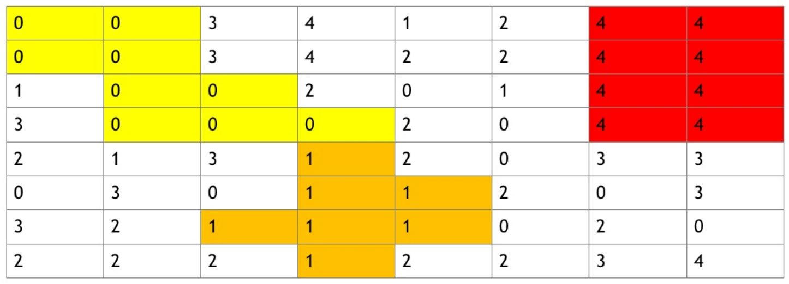

# Find The Block

When the user clicks on the "Start" button, the grid will get filled by random icons. There are 5 different icons.

After the icons are placed. The program finds all blocks with the same icon and highlights the blocks with more than 5 icons.

Icons must be connected only vertically or horizontally.

Here's an example

